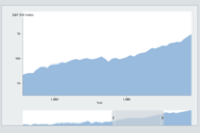

# Easily Learned Zooming

Scrollbars provide visual feedback that enables the user to discover where they have zoomed, and where they can oom. Handles on the ends of the scrollbars support one-dimensional zooming.

[This project demonstrates an easily learned user interface for zooming visualizations.](https://hemanrobinson.github.io/zooming-usability/)

