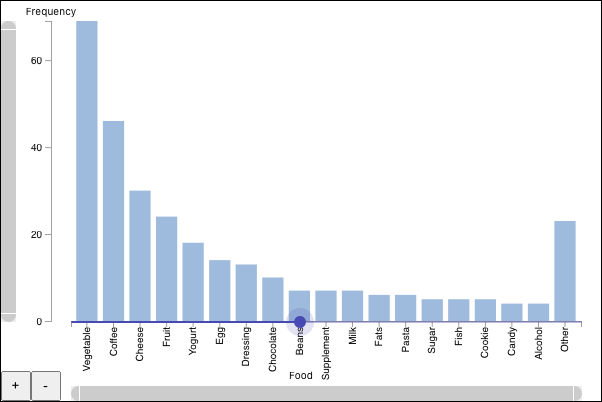

# Applying Shneiderman's Mantra to Aggregate Graphs

Shneiderman taught us all to [Overview first, zoom and filter, then details-on-demand](http://www.cs.umd.edu/~ben/papers/Shneiderman1996eyes.pdf).

These operations are straightforward for graphs that display individual points.  However, for large data sets, we must group the data into bins, bars, tiles, or other aggregates. Therefore, exploring aggregate graphs requires zooming both scales and aggregates.  

This project demonstrates [a user interface for efficient zooming](https://hemanrobinson.github.io/zoom/), of both continuous and categorical scales and aggregates, in multiple dimensions.

This project uses [d3](https://github.com/d3/d3) and [Material-UI](https://github.com/mui-org/material-ui), and was bootstrapped with [Create React App](https://github.com/facebook/create-react-app).
