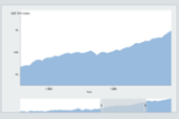

# Easily Learned Panning and Zooming

Scrollbars provide visual feedback that enables the user to discover where they have panned and zoomed, and where they can pan and zoom. The  scrollbars support panning, and handles on the ends of the scroll bars support one-dimensional zooming.

[This project demonstrates an easily learned user interface for panning and zooming.](https://hemanrobinson.github.io/panning-zooming/)

