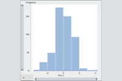

# Discoverable Zooming

What is the most easily learned user interface for zooming a graph?
              
The most familiar user interface uses plus (+) and minus (-) buttons, with scroll bars to provide panning and user feedback.  Handles on the ends of the scroll bars support one-dimensional zooming.

[This project demonstrates a user interface for zooming.  The elements of this design are easily learned because they are familiar.](https://hemanrobinson.github.io/zoom/)

This project uses [d3](https://github.com/d3/d3) and [Material-UI](https://github.com/mui-org/material-ui), and was bootstrapped with [Create React App](https://github.com/facebook/create-react-app).
