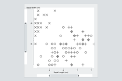

# Zooming Usability

Zoom bars provide visual feedback that enables the user to discover where they have zoomed, and where they can zoom. Handles on the ends of the zoom bars support one-dimensional zooming.

[This project demonstrates an easily learned user interface for zooming visualizations.](https://hemanrobinson.github.io/zooming-usability/)

